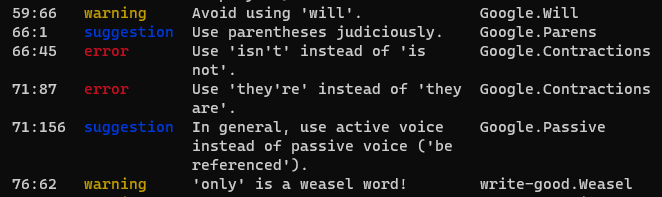

# Couchbase Vale Style Guide

This repository is the home of the Couchbase Style Guide, translated into Vale format! 

## Get Started 

To get started with the Vale Style guide, you need to: 

1. [Install Vale](#install-vale). 
2. [Set up a `.vale.ini` file](#set-up-a-valeini-file).
<!--- 3. [Configure your dicpath for Couchbase.Spelling](#configure-your-dicpath-for-couchbasespelling) -->

### Install Vale

To install Vale: 

1. Install a package manager: 
    - On Windows: [Chocolatey](https://chocolatey.org/install)
    - On Mac: [Homebrew](https://brew.sh/)
    - On GNU/Linux: Don't use the Snap package manager. [Download the precompiled binary of Vale](https://vale.sh/docs/vale-cli/installation/#github-releases).

2. Open a terminal application with administrator permissions. 

3. Follow the instructions at [Vale.sh](https://vale.sh/docs/vale-cli/installation/) for your platform. 

The package manager does all of the heavy lifting to install Vale. If you receive a prompt to run additional scripts from your terminal, approve it. 

### Set Up A .vale.ini File 

This repository contains a `.vale.ini` file that contains everything you need to get started. This file contains all of the necessary configuration for Vale to lint your text files.

Make a couple changes to make sure your Vale installation pulls your styles from the correct location: 

1. In your file explorer, move the `.vale.ini` from this repository to your `$HOME` directory: 
    - On Windows: `C:\Users\<yourusername>`
    - On Mac: `/Users/<yourusername>`
    - On Linux: the location of the `$HOME` directory varies based on your specific Linux distribution. 

2. Open the `.vale.ini` file in a text editor. 

3. Set the `StylesPath` to the location of the `ValeStyles` folder in this repository. 
    For example, `C:\Users\<yourusername>\GitHub\cb-vale-style-guide\ValeStyles`

<!-- I'm commenting this out as recent changes to the Spelling rules in Vale have made this redundant! -SW

### Configure your dicpath for `Couchbase.Spelling`

Unfortunately, the Spelling rule for the spellcheck searches for the path to the required dictionary relative to the directory where you're trying to lint. Not great. 

Set the location of the dictionary file:

1. Replace the `$REPO` in the `dicpath` attribute to the location of the `ValeStyles` folder in your local copy of this repository. --> 

### Install AsciiDoctor

To use Vale with AsciiDoc on Windows, you need to install Ruby before you can install AsciiDoctor. 

For all other systems, you can just install the AsciiDoctor package on your computer. 

#### Windows  

1. In a terminal window, run: 
```
choco install ruby
```

2. Then: 
```
gem install asciidoctor
```

#### MacOS 

1. In a terminal window, run: 
```
brew install asciidoctor
```

#### GNU/Linux 

Consult [the AsciiDoctor Docs](https://asciidoctor.org/#linux-package-managers) for details based on your specific distribution's package manager.

## Lint a File 

After you've done all the setup, you're ready to lint some files! 

1. Open the file or folder's location on your filesystem in a terminal window. 

2. Run `vale <FileName>` or `vale <FolderName>`. 

**Tip**: If you want Vale to print to a file that you can review later, add `> <outputFileName>.txt` to the end of your Vale command. 

Vale generates a report that provides the following information: 

1. If you ran Vale on a folder, the name of the file where Vale found the following list of issues.  
2. The line number and character/column number where Vale found an issue. 
3. The severity of the issue: Suggestion, Warning, or Error.
4. The description of why Vale flagged the issue. 
5. The location of the YAML file that flagged the issue, written as `<FolderName>.<FileName>`. 



If you run into issues linting a folder:

- Check your `.vale.ini` to see what file types Vale lints. If you see a [*] above the `BasedOnStyles` setting, Vale lints all file types. Enter a file type (`.adoc`, for example) to change the scope. 
- Change the folder to limit the scope of the files you want Vale to lint.

## Linting in Real Time

You can also get live feedback from the Vale VSCode extension:

1. Click **Extensions**  

2. Search for **Vale VSCode** (by Chris Chinchilla)
3. Click **Install**
4. Click the gear and go to **Extension Settings**  

5. In Config, input the path to your .vale.ini:
    * Mac: `/Users/<yourusername>/.vale.ini`
    * Windows: `C:\Users\<yourusername>\.vale.ini`
6. (Optional) Find the path to the Vale.exe and add it in the Path field:
    * Mac: `/usr/local/bin/vale`
    * Windows: `C:\ProgramData\chocolatey\lib\vale\tools\vale.exe`

> **Note**
The linter only updates when the you save the file. You can go to **File** and select **Auto Save** to have VSCode automatically save files as you are typing. Be aware that this setting applies globally, and may have side-effects elsewhere.


## Tweak Styles 

To tweak the existing styles, open any `.yml` file in a text editor and make your changes. 

Vale uses Go-based RegEx. If you need help to write a RegEx pattern, use a site like [regex101.com](https://regex101.com/) to learn syntax and test your patterns.

If you have a specific term like a page or product name that must be spelled the same and appear the same way everywhere, add it to the **Vocab** files: 

1. Go to `ValeStyles\Vocab\Couchbase Docs`. 
2. Do one of the following: 
    - To add a word or phrase that Vale should never flag as incorrect in any other rule, modify the `accept.txt` file. 
    - To add a word or phrase that Vale should always reject that isn't yet covered by another rule, modify the `reject.txt` file. 

Keep the following in mind: 

- Add only a single word or phrase per line to the `accept.txt` or `reject.txt`. 
- If multiple spellings for your word or phrase are correct, make sure that you add them with RegEx to the `accept.txt`. Otherwise, Vale flags any spellings or capitalization styles that don't exactly match what's present in the file. 
- If your word or phrase includes punctuation or other characters that are a part of RegEx syntax, make sure you escape them with a backslash (\\). Otherwise, Vale breaks. 
